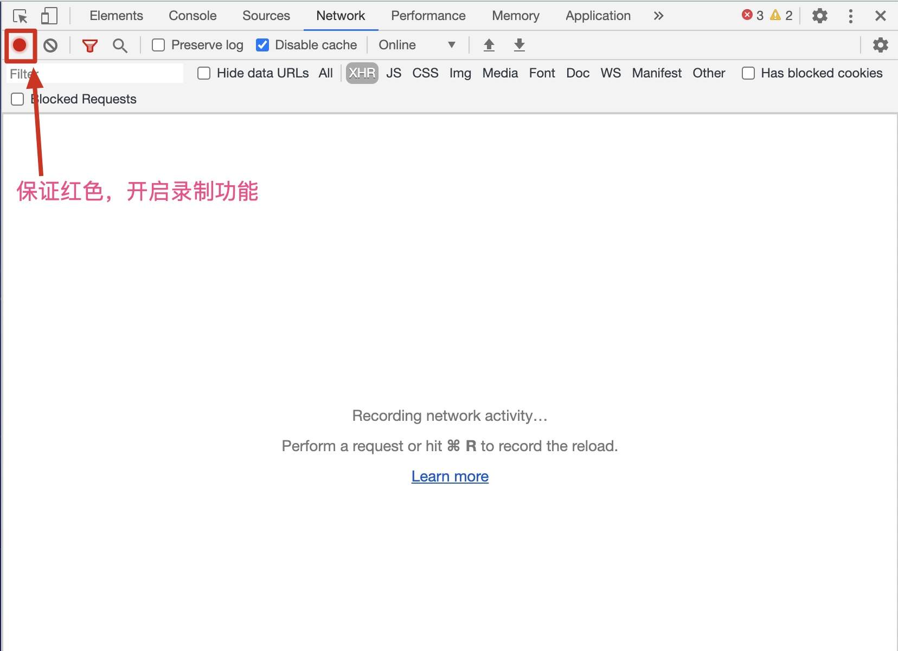
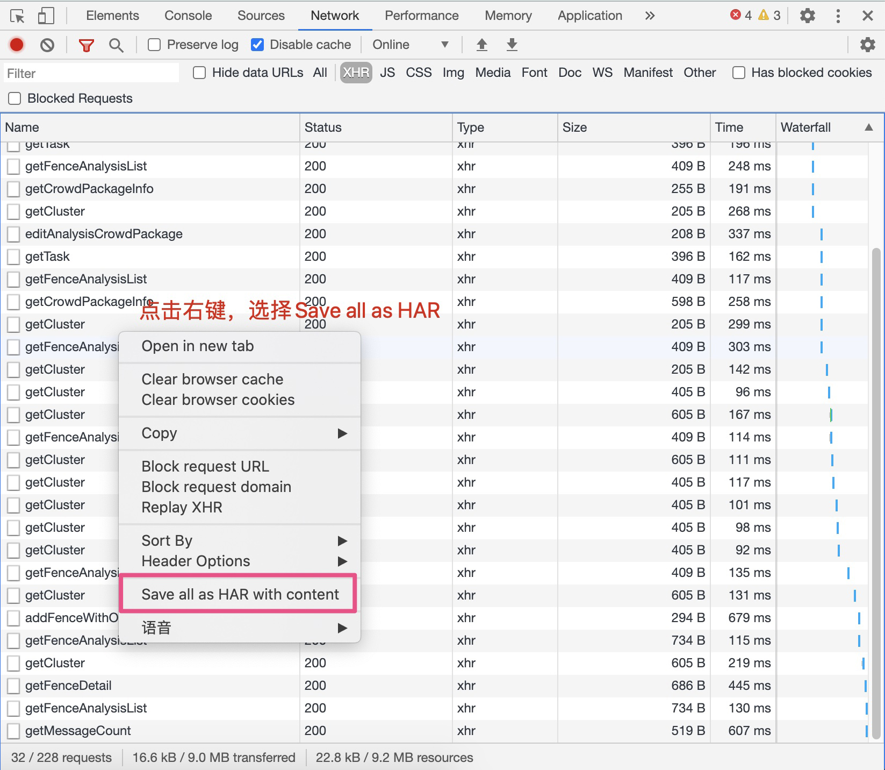
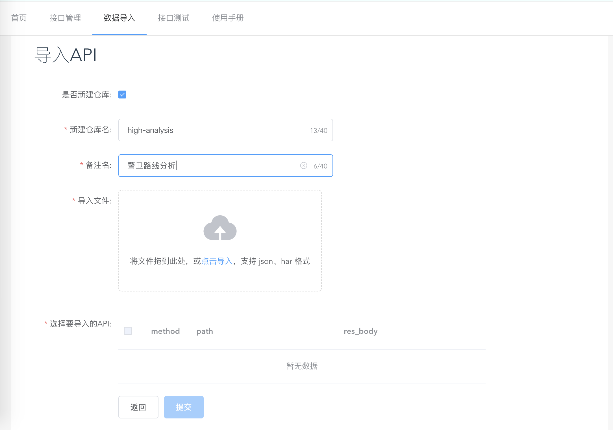
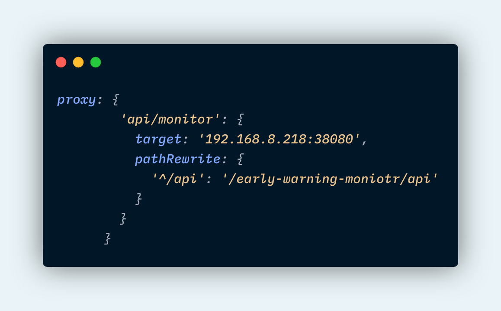
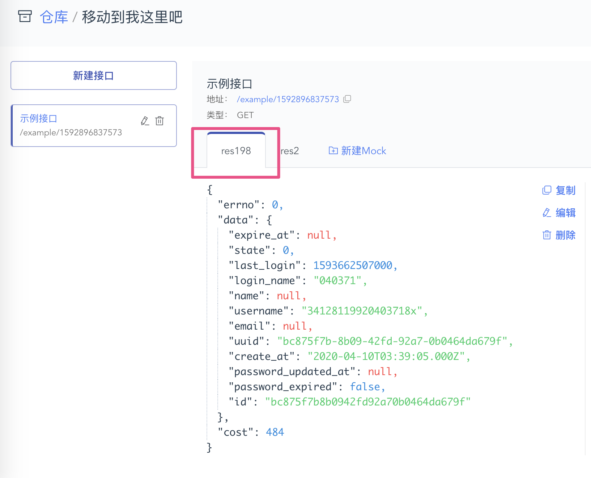

# Mock Data

## 数据导入

### HAR 数据导入

可用 chrome 实现录制接口数据的功能，方便快速导入项目接口

#### 1. 打开 Chrome 浏览器开发者工具，点击 network, 确保录制功能开启 (红色为开启状态)



#### 2. 操作页面实际功能，完成后点击 save as HAR with content,将数据保存



#### 3. 打开 mock 平台，进入数据导入页面，选择所导入的仓库或者新建仓库，将上一步导出的文件拖入，

页面会解析导入的文件，选择要导入的接口，点击提交即可



## 开发应用

该项目已经部署到开发网 192.168.8.218:9999 可以管理接口信息
开发过程中，如果想要获取 mock 数据，可以代理到 192.168.8.218:38080



对于某个API，可能在不同的仓库有不同的response,默认情况下，是返回最新的一条；
如果想要指定某个仓库，可以对代理的接口加入一个前缀

```js
/api/monitor/getList  => /early-warning-monitor/api/monitor/getLIst
```

针对一个接口有不同的res,默认返回的是第一个展示的，可以进行拖拽

