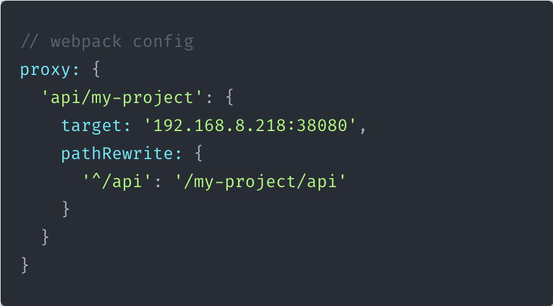
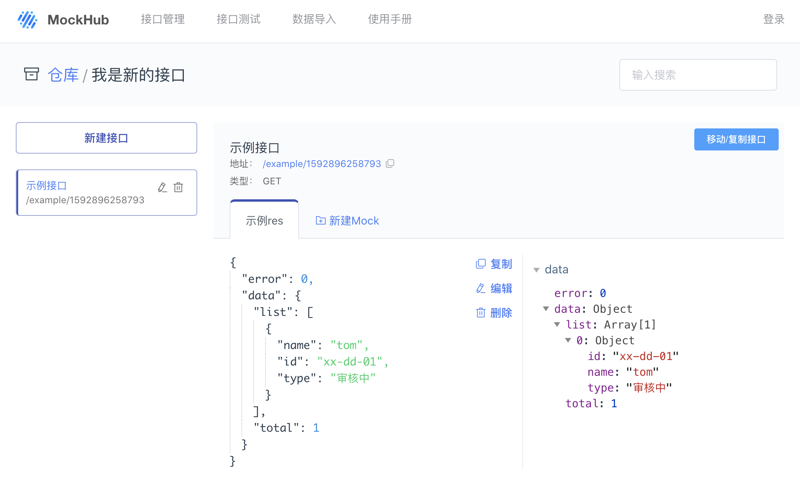

# 在开发环境使用 Mock 数据

在开发过程中，如果想要获取 mock 数据，可以将项目的请求代理到 http://192.168.8.218:38080



- 对于某个 API，可能在不同的仓库有不同的 response，默认情况下，MockHub 会返回最新的一条，拖拽改变接口的优先级
  

- 如果想要指定某个仓库，可以对代理的接口加入一个前缀：

  ```javascript
  /api/monitor/getList  => /early-warning-monitor/api/monitor/getLIst
  ```
