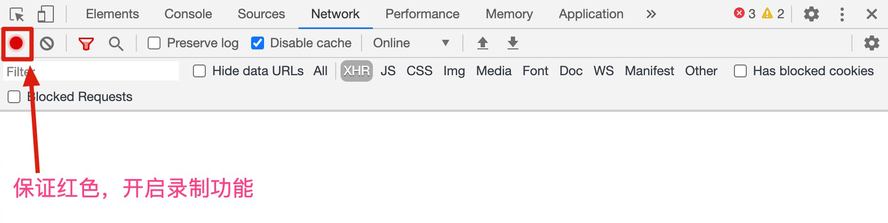

# 数据导入

## 使用 chrome 录制接口数据，以 HAR 格式批量导入：

1. 打开 Chrome 浏览器开发者工具，点击 network, 确保录制功能开启 (红色为开启状态)
  

2. 操作页面实际功能触发接口请求，完成所有操作后，右键选择“Save all as HAR with content”，将数据保存为 HAR 格式
  

3. 回到 MockHub 平台，进入数据导入页面，选择要导入的仓库或者新建仓库，将 HAR 文件拖入即可解析所有请求数据

  页面会解析出文件中的所有接口请求，选择要导入的接口，点击提交即可
  